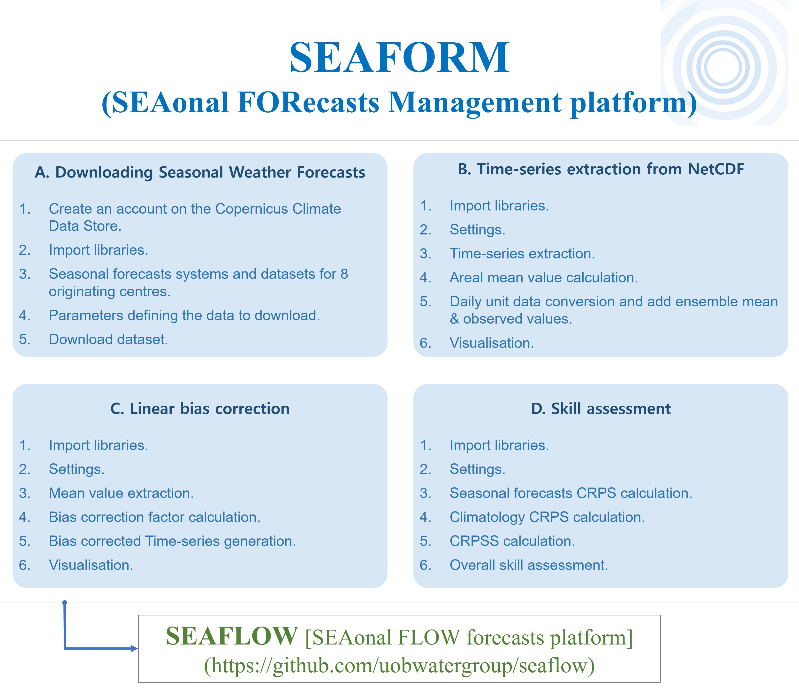

# SEAFORM (SEAsonal FORecasts Management platform)

Since the 2000s, seasonal forecasts have gained significant attention. Unlike short-term forecasts, which predict individual events, <b>seasonal forecasts aim to predict medium- to long-term periods of up to 7 months </b> (Arnal et al., 2018).

These forecasts can be extremely valuable for a wide range of stakeholders affected by climate, helping them to understand and better manage climate-related risks (Bruno Soares et al., 2016). For example, this forecasting technology can provide future precipitation, temperature, and runoff, allowing for early warnings of disasters such as droughts and heat/cold waves.

 * Additionally, this code can be linked to our <b>SEAsonal FLOW forecasts platform (SEAFLOW)</b>. Seasonal meteorological forecast data (such as precipitation, temperature, etc.) obtained from SEAFORM can be easily and efficiently translated into flow forecasts using SEAFLOW (https://github.com/uobwatergroup/seaflow).

To effectively use seasonal forecasts, their accuracy and reliability must be assessed and validated. <b>This code is developed to help you manage seasonal forecast datasets more easily and effectively.</b> It enables you to <b>download seasonal forecast datasets, extract them as time series, and analyze them with bias correction and skill assessment</b> using the CRPSS (Continuous Ranked Probability Skill Score) method.

For more details about Seasonal Meteorological Forecasts, please refer to our study (https://doi.org/10.1002/joc.8134)

Let's get started by downloading all the Jupyter Notebook files and folders (including util, assessment folders)

If you find any errors or any comments on this tool, <b>please email me(ocean47ys@gmail.com).</b>
