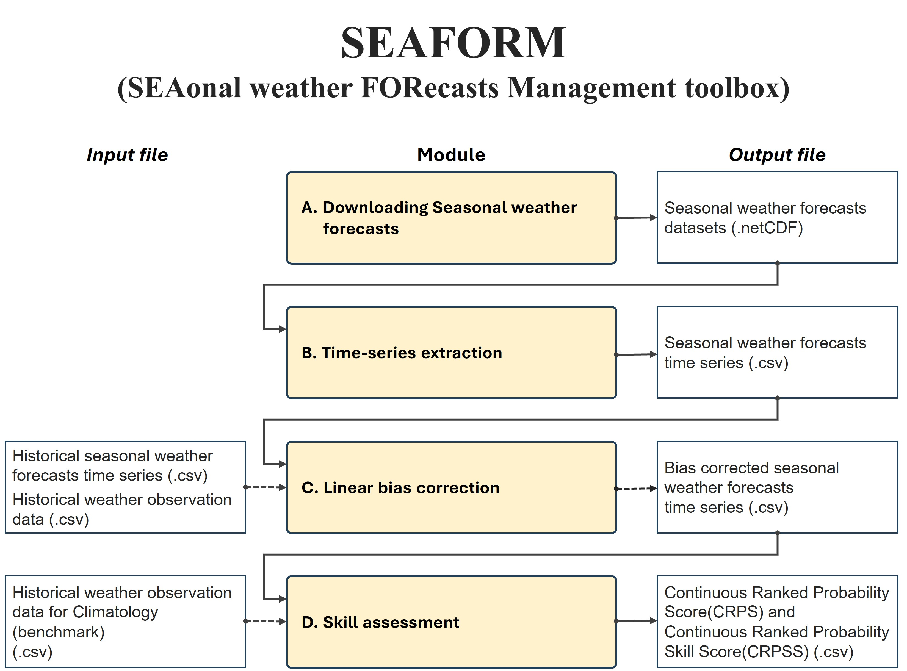

# SEAFORM (SEAsonal weather FORecasts Management toolbox)

Seasonal weather forecasts provide medium- to long-term periods of daily weather forecasts up to 7 months. SEAFORM is designed to <b>manipulate and assess seasonal weather forecasts</b> including <b>precipitation, temperature, and heat wave etc. </b> provided in the Copernicus Climate Data Store (https://cds.climate.copernicus.eu/). This toolbox was developed as part of a study <b>published by Lee et al.</b> (2023, https://doi.org/10.1002/joc.8134). 
 

Let's get started by downloading all the Jupyter Notebook files and folders (including util, assessment folders)

If you find any errors or any comments on this tool, <b>please email me(ocean47ys@gmail.com).</b>
