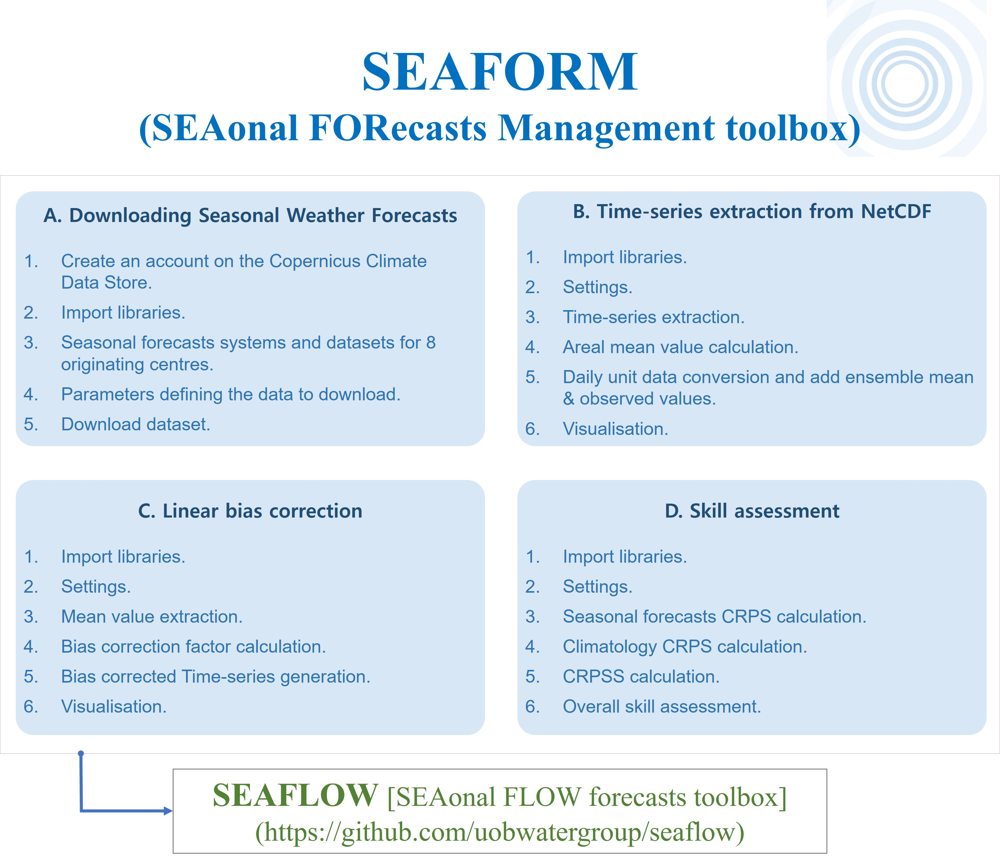

# SEAFORM (SEAsonal weather FORecasts Management toolbox)

Since the 2000s, seasonal weather forecasts have gained significant attention. Unlike short-term forecasts, which predict individual events, <b>seasonal weather forecasts aim to predict medium- to long-term periods of up to 7 months </b> (Arnal et al., 2018).

<b> This toolbox is designed to manipulate and assess seasonal weather forecasts, including precipitation, temperature, and heat wave provided in the Copernicus Climate Data Store (https://cds.climate.copernicus.eu/). This code was developed as part of a study published by Lee et al.(2023, https://doi.org/10.1002/joc.8134).</b>

Let's get started by downloading all the Jupyter Notebook files and folders (including util, assessment folders)

If you find any errors or any comments on this tool, <b>please email me(ocean47ys@gmail.com).</b>
